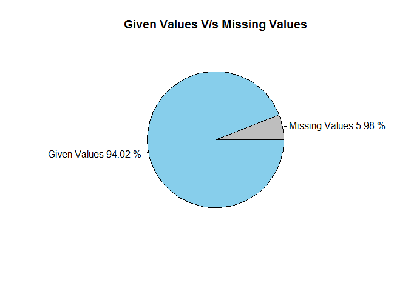
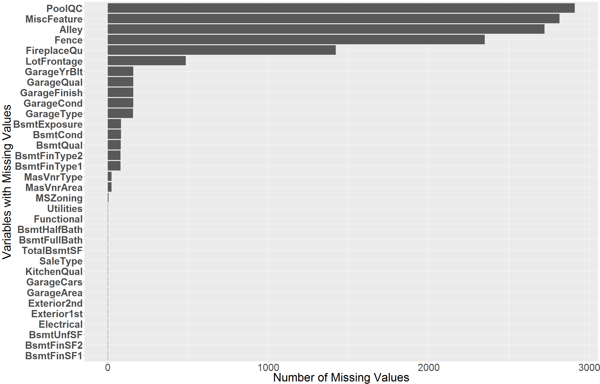
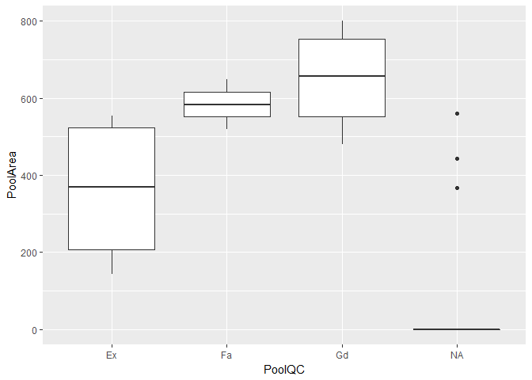
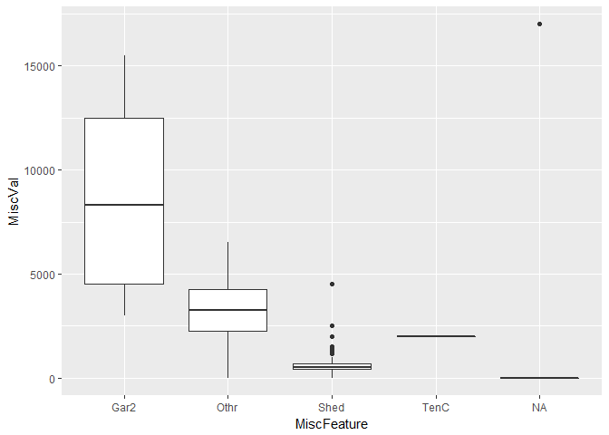
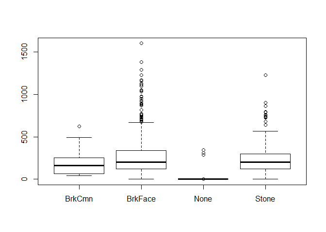
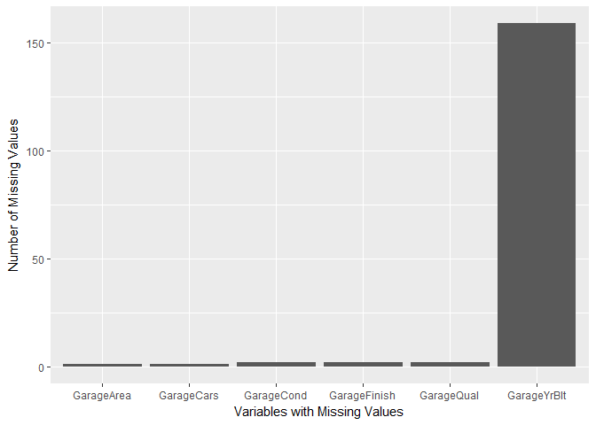

In depth analysis and Imputation of missing values
================
Pulkit Sikri

``` r
test.data = read.csv('test.csv',stringsAsFactors = F)
train.data=read.csv('train.csv',stringsAsFactors = F)

library(dplyr)
library(ggplot2)
library(randomForest)
library(missForest)
library(knitr)
```

#### First lets look at the structure of the data and get an overview of it.

``` r
target.variable = train.data$SalePrice
train.data$SalePrice = NULL

#Storing the target varibale seperatly and deleting it from training dataset

full = bind_rows(train.data,test.data)
str(full)
```

    ## 'data.frame':    2919 obs. of  80 variables:
    ##  $ Id           : int  1 2 3 4 5 6 7 8 9 10 ...
    ##  $ MSSubClass   : int  60 20 60 70 60 50 20 60 50 190 ...
    ##  $ MSZoning     : chr  "RL" "RL" "RL" "RL" ...
    ##  $ LotFrontage  : int  65 80 68 60 84 85 75 NA 51 50 ...
    ##  $ LotArea      : int  8450 9600 11250 9550 14260 14115 10084 10382 6120 7420 ...
    ##  $ Street       : chr  "Pave" "Pave" "Pave" "Pave" ...
    ##  $ Alley        : chr  NA NA NA NA ...
    ##  $ LotShape     : chr  "Reg" "Reg" "IR1" "IR1" ...
    ##  $ LandContour  : chr  "Lvl" "Lvl" "Lvl" "Lvl" ...
    ##  $ Utilities    : chr  "AllPub" "AllPub" "AllPub" "AllPub" ...
    ##  $ LotConfig    : chr  "Inside" "FR2" "Inside" "Corner" ...
    ##  $ LandSlope    : chr  "Gtl" "Gtl" "Gtl" "Gtl" ...
    ##  $ Neighborhood : chr  "CollgCr" "Veenker" "CollgCr" "Crawfor" ...
    ##  $ Condition1   : chr  "Norm" "Feedr" "Norm" "Norm" ...
    ##  $ Condition2   : chr  "Norm" "Norm" "Norm" "Norm" ...
    ##  $ BldgType     : chr  "1Fam" "1Fam" "1Fam" "1Fam" ...
    ##  $ HouseStyle   : chr  "2Story" "1Story" "2Story" "2Story" ...
    ##  $ OverallQual  : int  7 6 7 7 8 5 8 7 7 5 ...
    ##  $ OverallCond  : int  5 8 5 5 5 5 5 6 5 6 ...
    ##  $ YearBuilt    : int  2003 1976 2001 1915 2000 1993 2004 1973 1931 1939 ...
    ##  $ YearRemodAdd : int  2003 1976 2002 1970 2000 1995 2005 1973 1950 1950 ...
    ##  $ RoofStyle    : chr  "Gable" "Gable" "Gable" "Gable" ...
    ##  $ RoofMatl     : chr  "CompShg" "CompShg" "CompShg" "CompShg" ...
    ##  $ Exterior1st  : chr  "VinylSd" "MetalSd" "VinylSd" "Wd Sdng" ...
    ##  $ Exterior2nd  : chr  "VinylSd" "MetalSd" "VinylSd" "Wd Shng" ...
    ##  $ MasVnrType   : chr  "BrkFace" "None" "BrkFace" "None" ...
    ##  $ MasVnrArea   : int  196 0 162 0 350 0 186 240 0 0 ...
    ##  $ ExterQual    : chr  "Gd" "TA" "Gd" "TA" ...
    ##  $ ExterCond    : chr  "TA" "TA" "TA" "TA" ...
    ##  $ Foundation   : chr  "PConc" "CBlock" "PConc" "BrkTil" ...
    ##  $ BsmtQual     : chr  "Gd" "Gd" "Gd" "TA" ...
    ##  $ BsmtCond     : chr  "TA" "TA" "TA" "Gd" ...
    ##  $ BsmtExposure : chr  "No" "Gd" "Mn" "No" ...
    ##  $ BsmtFinType1 : chr  "GLQ" "ALQ" "GLQ" "ALQ" ...
    ##  $ BsmtFinSF1   : int  706 978 486 216 655 732 1369 859 0 851 ...
    ##  $ BsmtFinType2 : chr  "Unf" "Unf" "Unf" "Unf" ...
    ##  $ BsmtFinSF2   : int  0 0 0 0 0 0 0 32 0 0 ...
    ##  $ BsmtUnfSF    : int  150 284 434 540 490 64 317 216 952 140 ...
    ##  $ TotalBsmtSF  : int  856 1262 920 756 1145 796 1686 1107 952 991 ...
    ##  $ Heating      : chr  "GasA" "GasA" "GasA" "GasA" ...
    ##  $ HeatingQC    : chr  "Ex" "Ex" "Ex" "Gd" ...
    ##  $ CentralAir   : chr  "Y" "Y" "Y" "Y" ...
    ##  $ Electrical   : chr  "SBrkr" "SBrkr" "SBrkr" "SBrkr" ...
    ##  $ X1stFlrSF    : int  856 1262 920 961 1145 796 1694 1107 1022 1077 ...
    ##  $ X2ndFlrSF    : int  854 0 866 756 1053 566 0 983 752 0 ...
    ##  $ LowQualFinSF : int  0 0 0 0 0 0 0 0 0 0 ...
    ##  $ GrLivArea    : int  1710 1262 1786 1717 2198 1362 1694 2090 1774 1077 ...
    ##  $ BsmtFullBath : int  1 0 1 1 1 1 1 1 0 1 ...
    ##  $ BsmtHalfBath : int  0 1 0 0 0 0 0 0 0 0 ...
    ##  $ FullBath     : int  2 2 2 1 2 1 2 2 2 1 ...
    ##  $ HalfBath     : int  1 0 1 0 1 1 0 1 0 0 ...
    ##  $ BedroomAbvGr : int  3 3 3 3 4 1 3 3 2 2 ...
    ##  $ KitchenAbvGr : int  1 1 1 1 1 1 1 1 2 2 ...
    ##  $ KitchenQual  : chr  "Gd" "TA" "Gd" "Gd" ...
    ##  $ TotRmsAbvGrd : int  8 6 6 7 9 5 7 7 8 5 ...
    ##  $ Functional   : chr  "Typ" "Typ" "Typ" "Typ" ...
    ##  $ Fireplaces   : int  0 1 1 1 1 0 1 2 2 2 ...
    ##  $ FireplaceQu  : chr  NA "TA" "TA" "Gd" ...
    ##  $ GarageType   : chr  "Attchd" "Attchd" "Attchd" "Detchd" ...
    ##  $ GarageYrBlt  : int  2003 1976 2001 1998 2000 1993 2004 1973 1931 1939 ...
    ##  $ GarageFinish : chr  "RFn" "RFn" "RFn" "Unf" ...
    ##  $ GarageCars   : int  2 2 2 3 3 2 2 2 2 1 ...
    ##  $ GarageArea   : int  548 460 608 642 836 480 636 484 468 205 ...
    ##  $ GarageQual   : chr  "TA" "TA" "TA" "TA" ...
    ##  $ GarageCond   : chr  "TA" "TA" "TA" "TA" ...
    ##  $ PavedDrive   : chr  "Y" "Y" "Y" "Y" ...
    ##  $ WoodDeckSF   : int  0 298 0 0 192 40 255 235 90 0 ...
    ##  $ OpenPorchSF  : int  61 0 42 35 84 30 57 204 0 4 ...
    ##  $ EnclosedPorch: int  0 0 0 272 0 0 0 228 205 0 ...
    ##  $ X3SsnPorch   : int  0 0 0 0 0 320 0 0 0 0 ...
    ##  $ ScreenPorch  : int  0 0 0 0 0 0 0 0 0 0 ...
    ##  $ PoolArea     : int  0 0 0 0 0 0 0 0 0 0 ...
    ##  $ PoolQC       : chr  NA NA NA NA ...
    ##  $ Fence        : chr  NA NA NA NA ...
    ##  $ MiscFeature  : chr  NA NA NA NA ...
    ##  $ MiscVal      : int  0 0 0 0 0 700 0 350 0 0 ...
    ##  $ MoSold       : int  2 5 9 2 12 10 8 11 4 1 ...
    ##  $ YrSold       : int  2008 2007 2008 2006 2008 2009 2007 2009 2008 2008 ...
    ##  $ SaleType     : chr  "WD" "WD" "WD" "WD" ...
    ##  $ SaleCondition: chr  "Normal" "Normal" "Normal" "Abnorml" ...

#### At a glance, we can see that there are some variables which has NA values. Let us look deeper into it graphically!

Pie Chart of Missing Values
---------------------------

``` r
sum.missing = sum(is.na(full))
sum.given = sum(!is.na(full))
total.values = prod(dim(full))
pct.missing = round(sum.missing*100/total.values,2)
pct.given = round(sum.given*100/total.values,2)
k=c(sum.missing,sum.given)
pie(k,labels = c(paste("Missing Values",pct.missing,"%"),
                 paste("Given Values",pct.given,"%")),
                 main = "Given Values V/s Missing Values",
                 col=c("Grey","Sky Blue"))
```



#### The above Pie Chart shows Percentage of given and missing values.

Displaying only the variables with missing data
-----------------------------------------------

``` r
num_na = sort(colSums(is.na(full)),decreasing = T)
num_na = num_na[num_na>0]
ggplot()+
  geom_bar(aes(x=reorder(names(num_na),num_na),y=num_na),stat = 'identity')+
  xlab("Variables with Missing Values")+
  ylab("Number of Missing Values") +
  coord_flip() +
  theme(axis.text.y  = element_text(size=30, face = "bold"),
        axis.text.x = element_text(size=30),
        axis.title.x = element_text(size = 35),
        axis.title.y = element_text(size = 35))
```



Let's Start!
------------

Let's start imputing the missing values. So get ready to dive into the data and make sure to take a deep breath because we're going to dive deep into the data.

**I would suggest you to look at the given description of the data in the txt file simultaneously to get a better understanding of missing data.**

PoolQC
------

According to the description, The missing values in PoolQC denotes no pool, but some of the missing value may actually be missing also. We also have another variable 'PoolArea' using which we can see if there is any data missing about PoolQC.

``` r
kable(full %>% filter(PoolArea>0,is.na(PoolQC)) %>% select(c("Id","PoolArea","PoolQC")))
```

|    Id|  PoolArea| PoolQC |
|-----:|---------:|:-------|
|  2421|       368| NA     |
|  2504|       444| NA     |
|  2600|       561| NA     |

We see that there are three observations which have a PoolArea but the PoolQC is missing. Let's try to fill in these values by looking at the boxplot of PoolArea wrt PoolQC

``` r
ggplot(full,aes(x= PoolQC,y=PoolArea))+
  geom_boxplot()
```



The BoxPlot beautifully shows 3 NA values with the given Pool Area, we will fill in the PoolQC for these values by looking the closest PoolArea median.

``` r
full[full$Id %in% c(2421,2504),"PoolQC"] = "Ex"
full[full$Id == 2600,"PoolQC"] = "Fa"
```

For, the rest of the observation we will fill in "No Pool"

``` r
full[is.na(full$PoolQC),"PoolQC"] = "No Pool"
```

MiscFeature
-----------

Just like we compared PoolQC and PoolArea, we will also compare MiscFeature and Miscval

``` r
kable(full %>% filter(MiscVal > 0,is.na(MiscFeature)) %>% select("Id","MiscFeature","MiscVal"))
```

|    Id| MiscFeature |  MiscVal|
|-----:|:------------|--------:|
|  2550| NA          |    17000|

``` r
ggplot(full,aes(x= MiscFeature,y=MiscVal))+
  geom_boxplot()
```



``` r
full[full$Id == 2550,"MiscFeature"] = "Gar2"

full[is.na(full$MiscFeature),"MiscFeature"] = "None"
```

Alley
-----

Since, we do not have anything with which we can compare our missing values of Alley, we will just assume that the missing values here means - "No Allet Access" as per the description given.

``` r
full[is.na(full$Alley),"Alley"] = "No Alley Access"
```

Fence
-----

Same as Alley

``` r
full[is.na(full$Fence),"Fence"] = "No Fence"
```

FireplaceQu
-----------

Comparing FireplaceQu with Fireplaces

``` r
kable(full %>% filter(is.na(FireplaceQu),Fireplaces>0) %>% select(Id,Fireplaces,FireplaceQu))
```

Id Fireplaces FireplaceQu --- ----------- ------------

Since no rows are selected, we can conclude that there are no missing for FireplaceQu and the NA values are "No Fireplace" as per the description.

``` r
full[is.na(full$FireplaceQu),"FireplaceQu"] = "No Fireplace"
```

Lotfrontage
-----------

We, can compare Lotfrontage with with three given variables - "LotArea","LotConfig" and "LotShape". To get the values of Lotfrontage, we'll let RandomForest do it's magic.

``` r
full$LotConfig = as.factor(full$LotConfig)
full$LotShape = as.factor(full$LotShape)
regressor = randomForest(x=full[!is.na(full$LotFrontage),c("LotArea","LotConfig","LotShape")],y=na.omit(full$LotFrontage),ntree = 200)


full[is.na(full$LotFrontage),"LotFrontage"] = predict(regressor,newdata = full[is.na(full$LotFrontage),c("LotArea","LotConfig","LotShape")])
```

Garage
------

We have a few variables related to garage which are missing and according to the description NA values means there is no garage, If all these variables are missing together, we can easily say that there is no garage but even if value for any one of the variable is known wrt any other(s) being missing, we'll try to impute those missing values.

While I was looking at the variables, I looked at the table for GarageYrBlt and found out that one value was given as 2207 which is most probably a typo for the year '2007', so we will just correct it before moving further.

``` r
table(full$GarageYrBlt)
```

    ## 
    ## 1895 1896 1900 1906 1908 1910 1914 1915 1916 1917 1918 1919 1920 1921 1922 
    ##    1    1    6    1    1   10    2    7    6    2    3    1   33    5    8 
    ## 1923 1924 1925 1926 1927 1928 1929 1930 1931 1932 1933 1934 1935 1936 1937 
    ##    6    8   15   15    5    7    2   27    4    4    1    4    8    7    6 
    ## 1938 1939 1940 1941 1942 1943 1945 1946 1947 1948 1949 1950 1951 1952 1953 
    ##   11   21   25   14    6    1   10    9    5   19   14   51   17   16   23 
    ## 1954 1955 1956 1957 1958 1959 1960 1961 1962 1963 1964 1965 1966 1967 1968 
    ##   37   24   41   34   42   36   37   31   35   34   35   34   39   36   48 
    ## 1969 1970 1971 1972 1973 1974 1975 1976 1977 1978 1979 1980 1981 1982 1983 
    ##   32   32   24   27   29   35   28   50   66   41   35   32   15    9   11 
    ## 1984 1985 1986 1987 1988 1989 1990 1991 1992 1993 1994 1995 1996 1997 1998 
    ##   19   18   12   18   20   19   26   17   27   49   39   35   40   44   58 
    ## 1999 2000 2001 2002 2003 2004 2005 2006 2007 2008 2009 2010 2207 
    ##   54   55   41   53   92   99  142  115  115   61   29    5    1

``` r
full[which(full$GarageYrBlt==2207),"GarageYrBlt"] = 2007
```

``` r
no.gar.id = full %>% filter(is.na(GarageType),is.na(GarageFinish),is.na(GarageQual),is.na(GarageCond)) %>% select(Id)
     
## getting the Ids for No garage
                                                                                         
full[full$Id %in% no.gar.id$Id,c("GarageType","GarageFinish","GarageCond","GarageQual")] = "No Garage"
```

Now, wherever is "No Garage", the value for "GarageYrBlt" can obviously not be known. Instead of filling in "No Garage" in the column "GarageYrBlt", I'll just leave it as it is, because I don't want to disturb the class of "GarageYrBlt" and change it to "character" from "int".

Now, let's look at the values which haven't been filled.

``` r
gar.ds = full[,c("GarageYrBlt","GarageType","GarageFinish","GarageCond","GarageCars","GarageArea","GarageQual")]

colSums(is.na(gar.ds))
```

    ##  GarageYrBlt   GarageType GarageFinish   GarageCond   GarageCars 
    ##          159            0            2            2            1 
    ##   GarageArea   GarageQual 
    ##            1            2

Ignoring the variable GarageYrBlt, we have we very few missing values in each column. Let us look the missing values of GarageFinish first.

``` r
kable(gar.ds[is.na(full$GarageFinish),])
```

|      |  GarageYrBlt| GarageType | GarageFinish | GarageCond |  GarageCars|  GarageArea| GarageQual |
|------|------------:|:-----------|:-------------|:-----------|-----------:|-----------:|:-----------|
| 2127 |           NA| Detchd     | NA           | NA         |           1|         360| NA         |
| 2577 |           NA| Detchd     | NA           | NA         |          NA|          NA| NA         |

Woah! we just searched for rows with missing values of "GarageFnish" and we ended up with two rows which have all the missing values for rest of the columns related to Garage. Coincidence? I think not.

If you look at the 'GarageYrBlt', we have missing values there also. Although, The first row contains some information related to GarageCars and GarageArea. But, we will assume that at the time of inquiry the Garages of these two houses were being built and therefore, the values relted to Garage are missing.

Basement
--------

Proceeding in the same manner as we did for garage.

``` r
no.bas.id = full %>% filter(is.na(BsmtCond),is.na(BsmtExposure),is.na(BsmtQual),is.na(BsmtFinType1),is.na(BsmtFinType2)) %>% select(Id)

full[full$Id %in% no.bas.id$Id,c("BsmtCond","BsmtExposure","BsmtQual","BsmtFinType1","BsmtFinType2")] = "No Basement"


bas.ds = full[,c("BsmtCond","BsmtExposure","BsmtQual","BsmtFinType1","BsmtFinType2","BsmtFullBath","BsmtHalfBath","BsmtFinSF1","BsmtFinSF2","BsmtUnfSF","TotalBsmtSF")]
```

After filling in the values where we were sure that there is no basement let us look at the remaning values.

``` r
colSums(is.na(bas.ds))
```

    ##     BsmtCond BsmtExposure     BsmtQual BsmtFinType1 BsmtFinType2 
    ##            3            3            2            0            1 
    ## BsmtFullBath BsmtHalfBath   BsmtFinSF1   BsmtFinSF2    BsmtUnfSF 
    ##            2            2            1            1            1 
    ##  TotalBsmtSF 
    ##            1

Okay, now we do have few values missing in each column. Let us see if this is the same case of Garage.

But, before proceeding let us look at "BsmtFullBath","BsmtHalfBath","BsmtFinSF1","BsmtFinSF2","BsmtUnfSF","TotalBsmtSF" columns each of which contains only 1 missing values.

``` r
kable(bas.ds[is.na(bas.ds$BsmtFinSF2),])
```

|      | BsmtCond    | BsmtExposure | BsmtQual    | BsmtFinType1 | BsmtFinType2 |  BsmtFullBath|  BsmtHalfBath|  BsmtFinSF1|  BsmtFinSF2|  BsmtUnfSF|  TotalBsmtSF|
|------|:------------|:-------------|:------------|:-------------|:-------------|-------------:|-------------:|-----------:|-----------:|----------:|------------:|
| 2121 | No Basement | No Basement  | No Basement | No Basement  | No Basement  |            NA|            NA|          NA|          NA|         NA|           NA|

Again, kaboom! we found all the missing values when we were only looking at missing value of 1 variable. Now for this house there is no Basement, so values for "BsmtFullBath","BsmtHalfBath","BsmtFinSF1","BsmtFinSF2","BsmtUnfSF","TotalBsmtSF" columns will be 0

``` r
bas.ds[2121,c("BsmtFullBath","BsmtHalfBath","BsmtFinSF1","BsmtFinSF2","BsmtUnfSF","TotalBsmtSF")] = 0
```

Let us look at other missing values now.

``` r
kable(bas.ds[is.na(bas.ds$BsmtCond),])
```

|      | BsmtCond | BsmtExposure | BsmtQual | BsmtFinType1 | BsmtFinType2 |  BsmtFullBath|  BsmtHalfBath|  BsmtFinSF1|  BsmtFinSF2|  BsmtUnfSF|  TotalBsmtSF|
|------|:---------|:-------------|:---------|:-------------|:-------------|-------------:|-------------:|-----------:|-----------:|----------:|------------:|
| 2041 | NA       | Mn           | Gd       | GLQ          | Rec          |             1|             0|        1044|         382|          0|         1426|
| 2186 | NA       | No           | TA       | BLQ          | Unf          |             0|             1|        1033|           0|         94|         1127|
| 2525 | NA       | Av           | TA       | ALQ          | Unf          |             0|             0|         755|           0|        240|          995|

Now we see that different columns have missing values in different rows, Therefore we will use package missForest to fill in these missing values.

``` r
for(i in 1:7){
    bas.ds[,i]=as.factor(bas.ds[,i])
}

temp = missForest(bas.ds,ntree = 200,xtrue = na.omit(bas.ds))
```

    ##   missForest iteration 1 in progress...done!
    ##   missForest iteration 2 in progress...done!
    ##   missForest iteration 3 in progress...done!

``` r
full[,c("BsmtCond","BsmtExposure","BsmtQual","BsmtFinType1","BsmtFinType2","BsmtFullBath","BsmtHalfBath","BsmtFinSF1","BsmtFinSF2","BsmtUnfSF","TotalBsmtSF")] = temp$ximp
```

Masvrn
------

Comparing MaxVnr with MasVnrArea.

``` r
kable(full %>% filter(is.na(MasVnrType),MasVnrArea>0) %>% select(Id,MasVnrType,MasVnrArea))
```

|    Id| MasVnrType |  MasVnrArea|
|-----:|:-----------|-----------:|
|  2611| NA         |         198|

``` r
boxplot(full$MasVnrArea~full$MasVnrType)
```



``` r
full[full$Id == 2611,"MasVnrType"] = "BrkCmn"
```

For the rest of the values MasVnrArea is missing, therefore we will fill in "None" for MasVnrArea and 0 for MasVnrArea

``` r
full[is.na(full$MasVnrType),"MasVnrType"] = "None"
full[is.na(full$MasVnrArea),"MasVnrArea"] = 0
```

Ms Zoning
---------

comparing MS zoning with MS Subclass

``` r
kable(table(full$MSSubClass,full$MSZoning))
```

|     |  C (all)|   FV|   RH|    RL|   RM|
|-----|--------:|----:|----:|-----:|----:|
| 20  |        3|   34|    4|  1016|   20|
| 30  |        8|    0|    2|    61|   67|
| 40  |        0|    0|    0|     4|    2|
| 45  |        0|    0|    1|     6|   11|
| 50  |        7|    0|    2|   159|  119|
| 60  |        0|   43|    0|   529|    3|
| 70  |        4|    0|    3|    57|   63|
| 75  |        0|    0|    0|     9|   14|
| 80  |        0|    0|    0|   115|    3|
| 85  |        0|    0|    0|    47|    1|
| 90  |        0|    0|    4|    92|   13|
| 120 |        0|   19|    6|   117|   40|
| 150 |        0|    0|    0|     1|    0|
| 160 |        0|   43|    0|    21|   64|
| 180 |        0|    0|    0|     0|   17|
| 190 |        3|    0|    4|    31|   23|

Looking at the above table, we can fill in missing values for MSzoning

``` r
kable(full %>% filter(is.na(full$MSZoning)) %>% select(Id,MSZoning,MSSubClass))
```

|    Id| MSZoning |  MSSubClass|
|-----:|:---------|-----------:|
|  1916| NA       |          30|
|  2217| NA       |          20|
|  2251| NA       |          70|
|  2905| NA       |          20|

``` r
full[full$Id %in% c(2217,2905),"MSZoning"] = "RL"
full[full$Id == 1916,"MSZoning"] = "RM"
full[full$Id == 2251,"MSZoning"] = "RM"
```

### Filling in mode value for columns Functional and Electrical.

``` r
full[is.na(full$Functional),"Functional"] = names(which.max(table(full$Functional)))
full[is.na(full$Electrical),"Electrical"] = names(which.max(table(full$Electrical)))
full[is.na(full$Utilities),"Utilities"] = names(which.max(table(full$Utilities)))
```

Exterior1st and 2nd
-------------------

We have 1 missing values for both Exterior 1st and 2nd.

``` r
kable(full %>% filter(is.na(Exterior1st)) %>% select(Id,Exterior1st,Exterior2nd,ExterQual,ExterCond))
```

|    Id| Exterior1st | Exterior2nd | ExterQual | ExterCond |
|-----:|:------------|:------------|:----------|:----------|
|  2152| NA          | NA          | TA        | TA        |

And again both of them are missing together and we have information about ExterQual and ExterCond. Let us see how we can use both of these information to impute the missing values.

``` r
kable(table(full$Exterior1st,full$Exterior2nd))
```

|         |  AsbShng|  AsphShn|  Brk Cmn|  BrkFace|  CBlock|  CmentBd|  HdBoard|  ImStucc|  MetalSd|  Other|  Plywood|  Stone|  Stucco|  VinylSd|  Wd Sdng|  Wd Shng|
|---------|--------:|--------:|--------:|--------:|-------:|--------:|--------:|--------:|--------:|------:|--------:|------:|-------:|--------:|--------:|--------:|
| AsbShng |       35|        0|        0|        0|       0|        1|        0|        0|        0|      0|        5|      0|       1|        1|        1|        0|
| AsphShn |        0|        2|        0|        0|       0|        0|        0|        0|        0|      0|        0|      0|       0|        0|        0|        0|
| BrkComm |        0|        0|        4|        0|       0|        0|        0|        0|        0|      0|        0|      0|       1|        0|        1|        0|
| BrkFace |        1|        0|        0|       44|       0|        0|        3|        0|        3|      0|        8|      3|       3|        1|       20|        1|
| CBlock  |        0|        0|        0|        0|       1|        0|        0|        0|        0|      0|        0|      0|       0|        1|        0|        0|
| CemntBd |        0|        0|        0|        0|       0|      124|        0|        0|        0|      0|        0|      0|       0|        0|        1|        1|
| HdBoard |        0|        1|        0|        1|       0|        0|      383|        6|        1|      0|       41|      0|       1|        0|        3|        5|
| ImStucc |        0|        0|        0|        0|       0|        0|        0|        1|        0|      0|        0|      0|       0|        0|        0|        0|
| MetalSd |        0|        1|        0|        0|       1|        0|        3|        0|      437|      0|        0|      0|       3|        2|        2|        1|
| Plywood |        0|        0|       18|        0|       1|        0|        6|        4|        0|      0|      186|      0|       0|        1|        4|        1|
| Stone   |        0|        0|        0|        0|       0|        0|        1|        0|        0|      0|        0|      1|       0|        0|        0|        0|
| Stucco  |        0|        0|        0|        1|       0|        1|        0|        0|        0|      0|        1|      1|      33|        0|        2|        4|
| VinylSd |        1|        0|        0|        0|       0|        0|        1|        1|        2|      1|        2|      0|       1|     1005|        2|        9|
| Wd Sdng |        1|        0|        0|        1|       0|        0|        7|        3|        4|      0|       17|      1|       3|        3|      353|       18|
| WdShing |        0|        0|        0|        0|       0|        0|        2|        0|        0|      0|       10|      0|       1|        0|        2|       41|

From this table we see that Exterior 1st and 2nd are mostly same so we will compute the value for one and fill in the same value for 2nd exterior.

``` r
kable(table(full$Exterior1st,full$ExterQual))
```

|         |   Ex|   Fa|   Gd|   TA|
|---------|----:|----:|----:|----:|
| AsbShng |    0|    5|    2|   37|
| AsphShn |    0|    1|    0|    1|
| BrkComm |    0|    0|    1|    5|
| BrkFace |    1|    0|   18|   68|
| CBlock  |    0|    1|    0|    1|
| CemntBd |   29|    0|   49|   48|
| HdBoard |    1|    2|   75|  364|
| ImStucc |    0|    0|    1|    0|
| MetalSd |   21|    5|   76|  348|
| Plywood |    0|    2|   27|  192|
| Stone   |    0|    0|    1|    1|
| Stucco  |    2|    1|   10|   30|
| VinylSd |   51|    4|  664|  306|
| Wd Sdng |    1|   11|   44|  355|
| WdShing |    1|    3|   11|   41|

The top contendors for missing value of Exterior are HdBoard,MetalSd,Vinlysd and Wd Sdng when comparing it with ExterQual.

``` r
kable(table(full$Exterior1st,full$ExterCond))
```

|         |   Ex|   Fa|   Gd|   Po|   TA|
|---------|----:|----:|----:|----:|----:|
| AsbShng |    0|    7|    4|    1|   32|
| AsphShn |    0|    1|    0|    0|    1|
| BrkComm |    0|    1|    0|    0|    5|
| BrkFace |    0|    2|    7|    0|   78|
| CBlock  |    0|    1|    0|    0|    1|
| CemntBd |    0|    0|    8|    0|  118|
| HdBoard |    0|    7|   34|    1|  400|
| ImStucc |    0|    0|    0|    0|    1|
| MetalSd |    3|   12|   75|    0|  360|
| Plywood |    0|    4|   26|    0|  191|
| Stone   |    0|    0|    0|    0|    2|
| Stucco  |    0|    4|    8|    0|   31|
| VinylSd |    6|    4|   86|    0|  929|
| Wd Sdng |    3|   19|   48|    1|  340|
| WdShing |    0|    5|    3|    0|   48|

The top contendors for missing value of Exterior are again HdBoard,MetalSd,Vinlysd and Wd Sdng when comparing it with ExterCond.

``` r
kable(table(full$ExterQual,full$ExterCond))
```

|     |   Ex|   Fa|   Gd|   Po|    TA|
|-----|----:|----:|----:|----:|-----:|
| Ex  |    3|    0|    3|    0|   101|
| Fa  |    0|   19|    1|    1|    14|
| Gd  |    3|    1|   75|    0|   900|
| TA  |    6|   47|  220|    2|  1523|

We also see that The ExterQual and ExterCond are most likely same only.

Using a probabilistic approach (I actually used pen and paper) we see that VinlySd is the most probable outcome.

``` r
full[full$Id==2152,c("Exterior1st","Exterior2nd")] = "VinylSd"
```

KitchenQual
-----------

Comparing KitchenQual with KitchenAbvGr

``` r
kable(table(full$KitchenQual,full$KitchenAbvGr))
```

|     |    0|     1|    2|    3|
|-----|----:|-----:|----:|----:|
| Ex  |    0|   205|    0|    0|
| Fa  |    0|    61|    9|    0|
| Gd  |    0|  1146|    5|    0|
| TA  |    3|  1372|  115|    2|

``` r
kable(full %>% filter(is.na(KitchenQual)) %>% select(Id,KitchenQual,KitchenAbvGr))
```

|    Id| KitchenQual |  KitchenAbvGr|
|-----:|:------------|-------------:|
|  1556| NA          |             1|

``` r
full[full$Id == 1556,"KitchenQual"] = "TA"
```

Sale Type
---------

Comparing Saletype with SaleCondition.

``` r
kable(table(full$SaleType,full$SaleCondition))
```

|       |  Abnorml|  AdjLand|  Alloca|  Family|  Normal|  Partial|
|-------|--------:|--------:|-------:|-------:|-------:|--------:|
| COD   |       46|        0|       0|       2|      39|        0|
| Con   |        0|        0|       0|       0|       4|        1|
| ConLD |        3|        0|       0|       1|      21|        1|
| ConLI |        2|        0|       0|       2|       5|        0|
| ConLw |        0|        0|       0|       1|       7|        0|
| CWD   |        1|        0|       0|       1|      10|        0|
| New   |        0|        0|       0|       0|       0|      239|
| Oth   |        5|        0|       0|       1|       1|        0|
| WD    |      133|       12|      24|      38|    2314|        4|

``` r
kable(full %>% filter(is.na(full$SaleType)) %>% select(Id,SaleType,SaleCondition))
```

|    Id| SaleType | SaleCondition |
|-----:|:---------|:--------------|
|  2490| NA       | Normal        |

``` r
full[full$Id == 2490,"SaleType"] = "WD"
```

Let us look if there's any missing value which is left.
-------------------------------------------------------

``` r
num_na = sort(colSums(is.na(full)),decreasing = T)
num_na = num_na[num_na>0]
ggplot()+
  geom_bar(aes(x=reorder(names(num_na),num_na),y=num_na),stat = 'identity')+
  xlab("Variables with Missing Values")+
  ylab("Number of Missing Values")
```



All the missing values which are left are the ones which we left on purpose. Whew! even after going through variable by variable, we still have some missing data. But then again, it's not really 'missing', is it?
